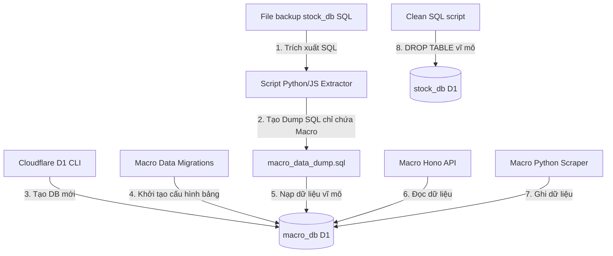

# Tài liệu Thiết kế: Tách biệt Cơ sở dữ liệu Vĩ mô (macro_db) từ stock_db trên Cloudflare D1

* **Mã tác vụ (Task ID):** `sync-2025-r9l-part2`
* **Ngày tạo:** 2026-06-05
* **Tác giả:** AI Assistant (Antigravity)
* **Trạng thái:** Chờ duyệt (Draft)

---

## 1. Giới thiệu & Mục tiêu (Overview & Goals)

Hiện tại, cơ sở dữ liệu `stock_db` chứa cả dữ liệu phân tích doanh nghiệp và dữ liệu vĩ mô (macro) của Việt Nam cùng các thị trường hàng hóa thế giới. Việc gom chung này gây phình to dung lượng `stock_db` và làm tăng nguy cơ xung đột khi nhiều dự án khác nhau (như API vĩ mô, API phân tích chứng khoán) cùng truy cập.

Mục tiêu của thiết kế này là tách biệt hoàn toàn dữ liệu vĩ mô sang một cơ sở dữ liệu D1 mới độc lập, giúp cô lập tài nguyên, tăng tốc độ truy vấn và quản lý cấu trúc cơ sở dữ liệu dễ dàng hơn.

### Mục tiêu chính:
1. **Khởi tạo Database mới:** Tạo cơ sở dữ liệu D1 mang tên `macro_db` trên Cloudflare.
2. **Bảo toàn dữ liệu 100%:** Trích xuất và di chuyển toàn bộ dữ liệu lịch sử vĩ mô từ `stock_db` sang `macro_db` mà không làm thay đổi hay mất mát dữ liệu.
3. **Cấu hình & Tương thích ngược:** Cập nhật cấu hình của dự án `Macro_Data` (API + Scraper) sang database mới. Đảm bảo toàn bộ API endpoint cũ của Hono hoạt động bình thường mà không cần sửa đổi logic nghiệp vụ.
4. **Dọn dẹp Stock DB:** Xóa bỏ ~30 bảng vĩ mô cũ khỏi `stock_db` để tối ưu hóa dung lượng lưu trữ của cơ sở dữ liệu doanh nghiệp.

---

## 2. Danh sách các bảng Vĩ mô (Macro Tables) cần di chuyển

Dựa trên cấu trúc di chuyển và định nghĩa bảng hiện tại, có tổng cộng 30 bảng vĩ mô cần tách ra khỏi `stock_db`:

1. **Bảng cơ bản & Chỉ số:**
   * `annual_report_queue` (Lưu ý: Bảng này thuộc về luồng stock_data, chúng ta sẽ giữ lại ở `stock_db`, không chuyển đi)
   * `daily_quota_log` (Lưu ý: Giữ lại ở `stock_db`)
   * `gold_price`
   * `news_index`
   * `business_models` (Lưu ý: Giữ lại ở `stock_db`)
   * `financial_documents` (Lưu ý: Giữ lại ở `stock_db`)
   * `daily_research`
   * `metadata`

2. **Dữ liệu Vĩ mô & Kinh tế (Macro Economy):**
   * `macro_gdp`
   * `macro_cpi`
   * `macro_economy_credit`
   * `macro_economy_fdi`
   * `macro_economy_import_export`
   * `macro_economy_money_supply`
   * `macro_economy_state_budget`
   * `macro_economy_total_investment`
   * `macro_economy_industry_prod`
   * `macro_economy_retail`
   * `macro_economy_population_labor`

3. **Dữ liệu Tiền tệ & Tỷ giá (Macro Currency):**
   * `macro_exchange_rate`
   * `macro_currency_interest_rate`
   * `macro_currency_deposit_rate`
   * `macro_currency_interbank_rate`
   * `macro_currency_omo`
   * `macro_currency_policy_rate`

4. **Dữ liệu Hàng hóa (Macro Commodities):**
   * `macro_commodity_coke`
   * `macro_commodity_corn`
   * `macro_commodity_gas`
   * `macro_commodity_iron_ore`
   * `macro_commodity_oil_crude`
   * `macro_commodity_pork`
   * `macro_commodity_soybean`
   * `macro_commodity_steel`
   * `macro_commodity_sugar`
   * `macro_commodity_gold`

5. **Dữ liệu Quốc tế (Macro Global):**
   * `macro_global_bond_yield`
   * `macro_global_fed_rate`
   * `macro_global_index`

---

## 3. Kiến trúc Di chuyển & Phân chia (Architecture & Migration Flow)



### Bước 1: Khởi tạo database mới
Tạo một D1 database mới trên Cloudflare bằng Wrangler CLI:
```bash
npx wrangler d1 create macro_db
```
Cấu hình liên kết trong `L:\Hung\crawl4ai\Macro_Data\wrangler.json` sẽ được đổi thành:
```json
  "d1_databases": [
    {
      "binding": "DB",
      "database_name": "macro_db",
      "database_id": "<new-database-id>"
    }
  ]
```

### Bước 2: Khởi tạo cấu trúc bảng (Migrations)
Áp dụng migrations hiện có của dự án `Macro_Data` để khởi tạo cấu trúc bảng trên database mới:
```bash
# Thực thi tại thư mục Macro_Data
npx wrangler d1 migrations apply macro_db --local
npx wrangler d1 migrations apply macro_db --remote
```

### Bước 3: Trích xuất và Nạp dữ liệu
Một script Node.js hoặc Python sẽ được viết để quét file backup `backup-before-index-20260605.sql`, trích xuất các dòng `INSERT` liên quan đến ~30 bảng vĩ mô được liệt kê ở trên và ghi ra tệp `macro_data_dump.sql`.

Sau đó, nạp dữ liệu này vào `macro_db`:
```bash
npx wrangler d1 execute macro_db --local --file="macro_data_dump.sql"
npx wrangler d1 execute macro_db --remote --file="macro_data_dump.sql"
```

### Bước 4: Kiểm chứng (TDD Verification)
Chúng ta sẽ viết các bài test Vitest tự động kiểm tra:
1. Xác nhận toàn bộ 30 bảng vĩ mô đã tồn tại trên database mới.
2. Kiểm tra dữ liệu thực tế: Đếm số lượng bản ghi của các bảng vĩ mô chính (như `macro_gdp`, `macro_cpi`), kỳ vọng lớn hơn 0.
3. Test tích hợp: Chạy thử `macro-api` local và gọi các endpoint vĩ mô để xác minh định dạng dữ liệu trả về 100% khớp với dữ liệu cũ.

### Bước 5: Dọn dẹp stock_db
Sau khi hoàn thành kiểm chứng, chúng ta sẽ sinh ra một file SQL `drop_macro_tables_stock_db.sql` chứa lệnh `DROP TABLE IF EXISTS` cho 30 bảng vĩ mô trên và thực thi lên `stock_db`:
```bash
npx wrangler d1 execute stock_db --local --file="drop_macro_tables_stock_db.sql"
npx wrangler d1 execute stock_db --remote --file="drop_macro_tables_stock_db.sql"
```

---

## 4. Đánh giá Rủi ro & Giải pháp (Risk Assessment & Mitigation)

| Rủi ro tiềm ẩn | Mức độ | Giải pháp phòng ngừa |
| :--- | :--- | :--- |
| **Gián đoạn API vĩ mô khi chuyển đổi:** Trong quá trình deploy API trỏ sang database mới, client gọi API có thể gặp lỗi. | Thấp | Cả hai database đều chạy song song. Sau khi import dữ liệu thành công lên `macro_db`, ta mới deploy API, thời gian chuyển đổi DNS/Routing của Cloudflare diễn ra tức thời (<1s) nên không có downtime. |
| **Mất mát dữ liệu trong quá trình import:** Thiếu dữ liệu do lỗi format SQL trích xuất. | Trung bình | Kiểm chứng bằng bài test TDD đếm số dòng dữ liệu (Row Count comparison) giữa `stock_db` và `macro_db` trước khi tắt/xóa bảng cũ. |
| **Ảnh hưởng đến các ứng dụng khác dùng chung `stock_db`:** Lệnh `DROP TABLE` vô tình xóa nhầm bảng của dự án khác. | Cao | Thiết lập danh sách bảng xóa một cách tường minh, tuyệt đối không dùng wildcard, chỉ xóa đúng ~30 bảng vĩ mô đã được chuyển đi thành công. |
