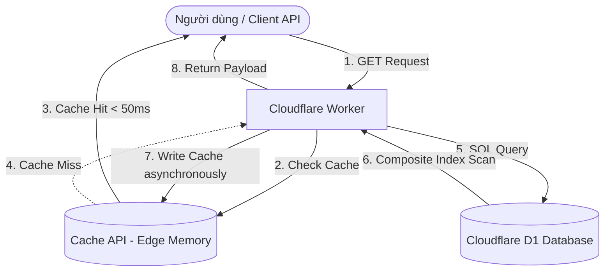

# Tài liệu Thiết kế: Tối ưu hóa Dữ liệu stock_db trên Cloudflare D1

* **Mã tác vụ (Task ID):** `sync-2025-r9l`
* **Ngày tạo:** 2026-06-05
* **Tác giả:** AI Assistant (Antigravity)
* **Trạng thái:** Chờ duyệt (Draft)

---

## 1. Giới thiệu & Mục tiêu (Overview & Goals)

Dự án hiện tại lưu trữ và xử lý báo cáo tài chính của các công ty Việt Nam trên Cloudflare D1 (`stock_db`). Khi quy mô dữ liệu tích lũy và số lượng truy vấn đọc tăng lên, hệ thống cần đảm bảo phản hồi nhanh chóng (Latency thấp nhất) và bảo vệ cơ sở dữ liệu khỏi việc quét toàn bộ bảng (Full Table Scan) vốn gây tốn chi phí đọc (D1 Read Rows).

Đặc biệt, có **nhiều dự án khác bên ngoài đang dùng chung dữ liệu từ `stock_db`**, do đó giải pháp tối ưu hóa phải đảm bảo **tính tương thích ngược 100% (Backward Compatibility)**, tuyệt đối không làm thay đổi cấu trúc bảng, tên trường hay kiểu dữ liệu hiện có.

### Mục tiêu chính:
1. **Giảm thiểu độ trễ truy vấn (Latency):** Phản hồi kết quả phân tích doanh nghiệp chi tiết trong vòng dưới 50ms cho các lượt truy vấn lặp lại.
2. **Tối ưu hóa chi phí đọc D1:** Giảm thiểu số lượng dòng quét thực tế trên D1 cho mỗi truy vấn xuống mức tối thiểu bằng Indexing.
3. **An toàn & Tương thích ngược:** Không ảnh hưởng đến bất kỳ ứng dụng hoặc Worker bên ngoài nào đang dùng chung database.

---

## 2. Kiến trúc Tổng quan (Architecture Overview)

Hệ thống tối ưu hóa được thiết kế gồm hai lớp độc lập hoạt động bổ trợ cho nhau:



1. **Lớp Database Indexing (Tầng D1):** Bổ sung các Composite Index (Chỉ mục hỗn hợp) vào các bảng con để tăng tốc độ truy vấn ở tầng SQL.
2. **Lớp Edge Caching (Tầng Worker):** Sử dụng Cloudflare Cache API tại Edge Server để lưu trữ kết quả tĩnh, giúp phản hồi tức thời mà không cần chạm đến Database.

---

## 3. Thiết kế Chi tiết (Detailed Design)

### Phần 1: Thiết kế Database Indexing (Tầng D1)

Trong SQLite (D1), thứ tự các cột trong Composite Index cực kỳ quan trọng để bộ tối ưu hóa truy vấn (Query Planner) hoạt động hiệu quả. Chúng ta sẽ đặt các cột so khớp bằng nhau trước (`ticker`), sau đó là các cột phân khoảng hoặc số (`year`, `reportType`).

Chúng ta sẽ bổ sung khai báo Index trực tiếp trong file [schema.ts](file:///L:/Hung/crawl4ai/stock_data/src/db/schema.ts) như sau:

#### 1. Các bảng con quan hệ 1-n (Chứa danh sách giao dịch, nợ nần, dự án):
Các bảng này sẽ được đánh chỉ mục hỗn hợp trên cặp cột `(ticker, year)` để tối ưu hóa truy vấn lọc và JOIN:
* **Bảng `related_party_transactions`:**
  * Tên index: `rp_tx_ticker_year_idx` trên `(ticker, year)`
* **Bảng `debts_breakdown`:**
  * Tên index: `debts_ticker_year_idx` trên `(ticker, year)`
* **Bảng `inventories_and_projects`:**
  * Tên index: `inv_proj_ticker_year_idx` trên `(ticker, year)`

#### 2. Các bảng metrics chuyên biệt (1-1 hoặc 1-n theo loại báo cáo):
Các bảng này thường được truy vấn chính xác theo mã, năm và loại báo cáo (`consolidated` hoặc `parent`), do đó ta đánh chỉ mục hỗn hợp trên cả 3 cột `(ticker, year, reportType)`:
* **Bảng `audit_reports`:** Index `audit_rep_ticker_year_rt_idx` trên `(ticker, year, reportType)`
* **Bảng `banking_metrics`:** Index `bank_met_ticker_year_rt_idx` trên `(ticker, year, reportType)`
* **Bảng `securities_metrics`:** Index `sec_met_ticker_year_rt_idx` trên `(ticker, year, reportType)`
* **Bảng `real_estate_metrics`:** Index `re_met_ticker_year_rt_idx` trên `(ticker, year, reportType)`
* **Bảng `general_metrics`:** Index `gen_met_ticker_year_rt_idx` trên `(ticker, year, reportType)`
* **Bảng `financial_insights`:** Index `fin_ins_ticker_year_rt_idx` trên `(ticker, year, reportType)`
* **Bảng `processed_reports`:** Index `proc_rep_ticker_year_rt_idx` trên `(ticker, year, reportType)`

*Mẫu code khai báo trong Drizzle:*
```typescript
import { index, sqliteTable, text, integer, real } from 'drizzle-orm/sqlite-core';

// Ví dụ cho bảng debtsBreakdown
export const debtsBreakdown = sqliteTable('debts_breakdown', {
  id: text('id').primaryKey(),
  ticker: text('ticker').notNull().references(() => companies.ticker, { onDelete: 'cascade' }),
  year: integer('year').notNull(),
  reportType: text('report_type').notNull(),
  // ... các cột khác
}, (table) => ({
  debtsTickerYearIdx: index('debts_ticker_year_idx').on(table.ticker, table.year),
}));
```

---

### Phần 2: Chiến lược Caching ở Edge (Tầng Cloudflare Workers)

Do dữ liệu báo cáo tài chính của các năm cũ gần như tĩnh tuyệt đối (không bao giờ thay đổi sau khi được phân tích xong), việc lưu trữ đệm ở Edge Server là phương án tối ưu nhất.

#### 1. Cơ chế hoạt động (Code Flow):
```javascript
async function handleRequest(request, env, ctx) {
  const url = new URL(request.url);
  const ticker = url.searchParams.get('ticker')?.toUpperCase();
  const year = url.searchParams.get('year');
  const reportType = url.searchParams.get('report_type') || 'consolidated';

  if (!ticker || !year) {
    return new Response("Missing parameters", { status: 400 });
  }

  // 1. Tạo Cache Key duy nhất
  const cacheUrl = new URL(request.url);
  // Đồng bộ hóa cache key bằng cách chuẩn hóa các tham số để tăng tỷ lệ Cache Hit
  cacheUrl.pathname = `/api/stock/${ticker}/${year}/${reportType}`;
  cacheUrl.search = ""; 
  const cacheKey = new Request(cacheUrl.toString(), request);
  const cache = caches.default;

  // 2. Tìm kiếm trong Cache
  let response = await cache.match(cacheKey);
  
  if (response) {
    // Thêm header để debug
    const headers = new Headers(response.headers);
    headers.set("X-Cache-Status", "HIT");
    return new Response(response.body, { headers });
  }

  // 3. Cache Miss: Thực hiện truy vấn dữ liệu từ D1 (Đã tối ưu Index)
  const data = await queryStockDataFromD1(env.DB, ticker, parseInt(year), reportType);

  // 4. Tạo Response mới với header Cache-Control
  response = new Response(JSON.stringify(data), {
    headers: {
      "Content-Type": "application/json",
      "Cache-Control": "public, max-age=31536000, immutable", // Cache trong 1 năm
      "X-Cache-Status": "MISS"
    }
  });

  // 5. Ghi đệm bất đồng bộ vào Cache mà không chặn luồng phản hồi chính
  ctx.waitUntil(cache.put(cacheKey, response.clone()));

  return response;
}
```

#### 2. Chiến lược Invalidate Cache:
* **Khi cập nhật/import dữ liệu mới:** Khi công cụ crawler hoặc làm giàu dữ liệu (`d1-loader.mjs`) cập nhật hoặc làm sạch dữ liệu của một doanh nghiệp trong một năm cụ thể, hệ thống sẽ thực hiện gửi một request xóa cache:
  ```javascript
  const cacheKey = new Request(`https://your-domain.com/api/stock/${ticker}/${year}/${reportType}`);
  await caches.default.delete(cacheKey);
  ```
  Điều này đảm bảo người dùng luôn nhận được dữ liệu mới nhất ngay sau khi quá trình làm giàu dữ liệu hoàn tất.

---

## 4. Kế hoạch Kiểm thử & Kiểm chứng (Testing & Verification)

Để chứng minh tính hiệu quả của kế hoạch, chúng ta sẽ thực hiện các bước kiểm chứng:
1. **Kiểm tra độ chính xác của Index (EXPLAIN QUERY PLAN):**
   Chạy các câu lệnh SQL kiểm tra kế hoạch truy vấn trong D1 console:
   ```sql
   EXPLAIN QUERY PLAN SELECT * FROM debts_breakdown WHERE ticker = 'VCB' AND year = 2024;
   ```
   *Kết quả mong đợi:* Phải hiển thị `SEARCH TABLE debts_breakdown USING INDEX debts_ticker_year_idx...` thay vì `SCAN TABLE`.
2. **Kiểm tra Latency & Cache Status:**
   * Lần gọi API đầu tiên: Latency khoảng 150-300ms, Header `X-Cache-Status: MISS`.
   * Các lần gọi tiếp theo: Latency < 50ms (thường chỉ 10-20ms ở Edge), Header `X-Cache-Status: HIT`.
3. **Kiểm tra tính tương thích ngược:**
   * Chạy lại toàn bộ test suite hiện có của dự án (`npm run test`).
   * Chạy pipeline nạp thử dữ liệu với một file OCR mẫu để đảm bảo `d1-loader.mjs` hoạt động bình thường, không xảy ra xung đột khóa hay lỗi cú pháp SQL.

---

## 5. Đánh giá Rủi ro & Giải pháp (Risk Assessment & Mitigation)

| Rủi ro tiềm ẩn | Mức độ | Giải pháp phòng ngừa |
| :--- | :--- | :--- |
| **Ghi chậm hơn:** Thêm index làm tăng thời gian thực thi các câu lệnh `INSERT` mới. | Thấp | Báo cáo tài chính là dữ liệu ghi một lần (Write-once), đọc nhiều lần (Read-heavy). Tác động này hoàn toàn có thể bỏ qua. |
| **Xung đột cache (Stale Cache):** Dữ liệu D1 được cập nhật nhưng cache ở Edge chưa xóa. | Trung bình | Tích hợp cơ chế tự động gửi request xóa cache hoặc sử dụng cache key chứa timestamp phiên bản của database. |
| **Lỗi migration:** Khi áp dụng schema mới lên D1 đang chạy thực tế (Production). | Thấp | Test migration kỹ lưỡng trên môi trường local trước (`wrangler d1 migrations apply --local`). Drizzle sẽ tự sinh ra file SQL migration rất an toàn. |
